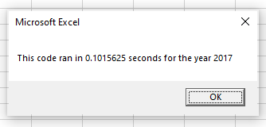
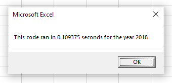

# Stock Analysis
## Overview of Project  
An analysis of stock data from 2017 and 2018 to uncover Daily Volume and Returns for 12 specific stocks.
### Purpose
The purpose of this project was to analyze data from twelve different green energy companies to discover which, if any, of the stocks are financially viable and worthy of investment.  
### VBA
The initial dataset contained over 3000 rows of data including stock ticker information, prices and total volume of stock traded.  I used Excel VBA to write code that pulls both the total daily volume, and percentage return for each stock.  I also created a button to make it easy for the user to choose a year and pull the data without having to open the developer tools of Excel himself.
## Conclusion
### Refactoring Green Stocks
After refactoring my code, my run time improved by roughly one-half of a second.  While that may not seem like a lot of time, if our dataset was bigger and included more years or more stock information, an efficient code could save a lot of time.  My refactored code took approximately 0.098 seconds to run, as seen below.

My 2018 run took approximately 0.109 seconds as seen below.

### Advantages & Disadvantages of Refactoring Code

### Results
My original code was successful in outputting the required data, but didn't use the most efficient coding for the objective.  After refactoring, my code was almost 1/2 second quicker, and also much easier to read and follow.  I reset my button to call the refactored macro and run the more efficient code.  My refactored code is below.

'Sub AllStocksAnalysisRefactored()
    Dim startTime As Single
    Dim endTime  As Single

    yearValue = InputBox("What year would you like to run the analysis on?")

    startTime = Timer
    
    'Format the output sheet on All Stocks Analysis worksheet
    Worksheets("All Stocks Analysis").Activate
    
    Range("A1").Value = "All Stocks (" + yearValue + ")"
    
    'Create a header row
    Cells(3, 1).Value = "Ticker"
    Cells(3, 2).Value = "Total Daily Volume"
    Cells(3, 3).Value = "Return"

    'Initialize array of all tickers
    Dim tickers(12) As String
    
    tickers(0) = "AY"
    tickers(1) = "CSIQ"
    tickers(2) = "DQ"
    tickers(3) = "ENPH"
    tickers(4) = "FSLR"
    tickers(5) = "HASI"
    tickers(6) = "JKS"
    tickers(7) = "RUN"
    tickers(8) = "SEDG"
    tickers(9) = "SPWR"
    tickers(10) = "TERP"
    tickers(11) = "VSLR"
    
    'Activate data worksheet
    Worksheets(yearValue).Activate
    
    'Get the number of rows to loop over
    RowCount = Cells(Rows.Count, "A").End(xlUp).Row
    
    '1a) Create a ticker Index
    tickerIndex = 0
    

    '1b) Create three output arrays
    Dim tickerVolumes(12) As Long
    Dim tickerStartingPrices(12) As Single
    Dim tickerEndingPrices(12) As Single
    
    
    '2a) Create a for loop to initialize the tickerVolumes to zero.
    For i = 0 To 11
        tickerVolumes(i) = 0
    Next i
    
        
    '2b) Loop over all the rows in the spreadsheet.
    For i = 2 To RowCount
                
        '3a) Increase volume for current ticker
        tickerVolumes(tickerIndex) = tickerVolumes(tickerIndex) + Cells(i, 8).Value
        
        
        '3b) Check if the current row is the first row with the selected tickerIndex.
        If Cells(i, 1).Value = tickers(tickerIndex) And Cells(i - 1, 1).Value <> tickers(tickerIndex) Then
            tickerStartingPrices(tickerIndex) = Cells(i, 6).Value
        End If
        
            
        '3c) check if the current row is the last row with the selected ticker
        If Cells(i, 1).Value = tickers(tickerIndex) And Cells(i + 1, 1).Value <> tickers(tickerIndex) Then
            tickerEndingPrices(tickerIndex) = Cells(i, 6).Value
        End If
        
        
        '3d Increase the tickerIndex.
        If Cells(i, 1).Value = tickers(tickerIndex) And Cells(i + 1, 1).Value <> tickers(tickerIndex) Then
            tickerIndex = tickerIndex + 1
        End If
    
    
    Next i
    
    '4) Loop through the arrays to output the Ticker, Total Daily Volume, and Return.
    For i = 0 To 11
        
        Worksheets("All Stocks Analysis").Activate
        Cells(4 + i, 1).Value = tickers(i)
        Cells(4 + i, 2).Value = tickerVolumes(i)
        Cells(4 + i, 3).Value = tickerEndingPrices(i) / tickerStartingPrices(i) - 1
     
        
    Next i
    
    'Formatting
    Worksheets("All Stocks Analysis").Activate
    'Change column headers to bold, 14 font and pretty color
    Range("A3:C3").Font.FontStyle = "Bold"
    Range("A3:C3").Font.Color = RGB(200, 0, 150)
    Range("A3:C3").Font.Size = 14
    Range("A3:C3").Borders(xlEdgeBottom).LineStyle = xlContinuous
    Range("B4:B15").NumberFormat = "#,##0"
    Range("C4:C15").NumberFormat = "0.0%"
    'Change heading to bold, 16 font and pretty color
    Range("A1").Font.Size = 16
    Range("A1").Font.Color = RGB(22, 0, 175)
    Range("A1").Font.FontStyle = "Bold"
    Columns("B").AutoFit

    dataRowStart = 4
    dataRowEnd = 15

    For i = dataRowStart To dataRowEnd
        
        If Cells(i, 3) > 0 Then
            
            Cells(i, 3).Interior.Color = vbGreen
            
        Else
        
            Cells(i, 3).Interior.Color = vbRed
            
        End If
        
    Next i
 
    endTime = Timer
    MsgBox "This code ran in " & (endTime - startTime) & " seconds for the year " & (yearValue)

